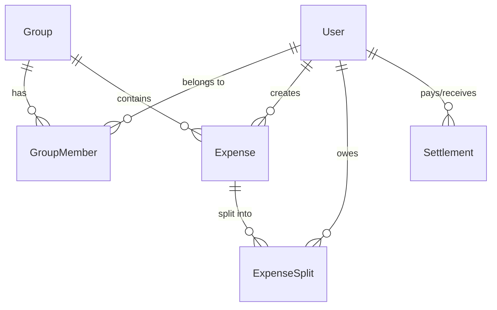

# Arquitectura de Partio

## Resumen

Partio es un SaaS de gastos compartidos construido siguiendo principios de **Clean Architecture**, **SOLID** y **API-first**. El sistema está diseñado para ser **modular**, **escalable** y **portable**.

## Decisiones de Arquitectura

### 1. Monorepo con pnpm workspaces

**Decisión**: Usar un monorepo para gestionar múltiples aplicaciones y paquetes.

**Razones**:
- Facilita el desarrollo y mantenimiento de código compartido
- Permite versionado conjunto de componentes relacionados
- Simplifica CI/CD y deployment
- Mejor experiencia de desarrollo con TypeScript

**Trade-offs**:
- ✅ Código compartido fácil de mantener
- ✅ Refactoring cross-package simplificado
- ❌ Repositorio más grande
- ❌ Complejidad inicial de setup

### 2. Clean Architecture + SOLID

**Decisión**: Implementar Clean Architecture con separación clara de capas.

**Estructura**:
```
src/
├── controllers/     # Capa de presentación (HTTP)
├── services/        # Lógica de negocio
├── repositories/    # Acceso a datos
├── middlewares/     # Cross-cutting concerns
└── lib/            # Infraestructura
```

**Beneficios**:
- Testabilidad alta
- Bajo acoplamiento
- Fácil mantenimiento
- Independencia de frameworks

### 3. Stack Tecnológico

#### Backend
- **Node.js + Express**: Ecosistema maduro, performance adecuada
- **TypeScript**: Type safety, mejor DX
- **Prisma + PostgreSQL**: ORM type-safe, ACID compliance para finanzas
- **Redis**: Cache y colas de mensajería
- **JWT**: Autenticación stateless

#### Frontend
- **React + Vite**: Ecosistema maduro, hot reload rápido
- **React Native**: Código compartido para móvil
- **PWA**: Funcionalidad offline

#### DevOps
- **Docker**: Containerización para portabilidad
- **Kubernetes**: Orquestación y escalado
- **GitHub Actions**: CI/CD integrado

### 4. Seguridad

**Implementaciones**:
- Autenticación JWT con refresh tokens
- Rate limiting por endpoint
- Validación estricta de inputs (Zod)
- Helmet.js para headers de seguridad
- CORS configurado
- Sanitización de datos

**Para Producción**:
- HTTPS obligatorio
- Secrets en KMS/Vault
- Auditoría de dependencias
- Monitoreo de seguridad

### 5. Escalabilidad

**Horizontal**:
- API stateless
- Cache distribuido (Redis)
- Load balancing
- HPA en Kubernetes

**Vertical**:
- Optimización de queries
- Indexación de BD
- Connection pooling

### 6. Observabilidad

**Logging**:
- Structured logging (Winston)
- Correlation IDs
- Diferentes niveles por entorno

**Métricas**:
- Health checks
- Performance metrics
- Business metrics

**Monitoreo**:
- Prometheus + Grafana
- Alertas automáticas
- Tracing distribuido

## Patrones Implementados

### 1. Repository Pattern
Abstrae el acceso a datos, facilita testing y cambio de persistencia.

### 2. Service Layer
Contiene lógica de negocio, orquesta repositorios y validaciones.

### 3. Middleware Pattern
Cross-cutting concerns como autenticación, logging, rate limiting.

### 4. Factory Pattern
Para creación de objetos complejos (Money, Splits).

### 5. Strategy Pattern
Para diferentes tipos de división de gastos (Equal, Exact, Percentage).

## Estructura de Datos

### Entidades Principales

1. **User**: Usuarios del sistema
2. **Group**: Grupos de gastos compartidos
3. **Expense**: Gastos individuales
4. **ExpenseSplit**: División de gastos entre usuarios
5. **Settlement**: Liquidaciones entre usuarios

### Relaciones



## Flujo de Datos

### 1. Creación de Gasto

```
Client → Controller → Service → Repository → Database
                   ↓
                 Cache Update
                   ↓
              Balance Calculation
```

### 2. Cálculo de Balances

```
Expenses → Split Calculator → Balance Aggregator → Settlement Suggestions
```

## Deployment

### Desarrollo
- Docker Compose para servicios locales
- Hot reload para desarrollo rápido
- Base de datos y Redis containerizados

### Producción
- Kubernetes para orquestación
- Horizontal Pod Autoscaler
- Ingress con SSL termination
- Secrets management

## Testing

### Estrategia
- Unit tests: Lógica de negocio (>90% coverage)
- Integration tests: APIs y base de datos
- E2E tests: Flujos críticos de usuario

### Herramientas
- Jest para unit/integration tests
- Supertest para API testing
- Cypress para E2E (futuro)

## Consideraciones de Performance

### Base de Datos
- Índices en campos frecuentemente consultados
- Connection pooling
- Query optimization
- Read replicas para escalado

### Cache
- Redis para session storage
- Cache de balances calculados
- Cache de tasas de cambio

### API
- Paginación en listados
- Rate limiting
- Compression (gzip)
- CDN para assets estáticos

## Roadmap Técnico

### Fase 1 (Actual)
- ✅ API básica con auth y CRUD
- ✅ Calculadora de splits
- ✅ Docker setup
- ✅ CI/CD pipeline

### Fase 2
- [ ] Frontend React completo
- [ ] App React Native
- [ ] Notificaciones push
- [ ] Integración de pagos

### Fase 3
- [ ] Microservicios
- [ ] Event sourcing
- [ ] Machine learning para categorización
- [ ] Multi-tenancy

## Métricas de Éxito

### Técnicas
- Uptime > 99.9%
- Response time < 200ms (p95)
- Zero downtime deployments
- Test coverage > 90%

### Negocio
- Time to market reducido
- Facilidad de onboarding de desarrolladores
- Escalabilidad sin refactoring mayor
- Costos de infraestructura optimizados
